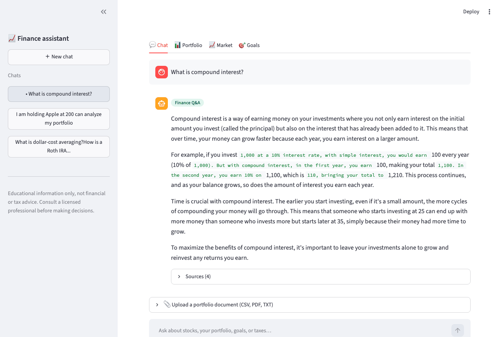
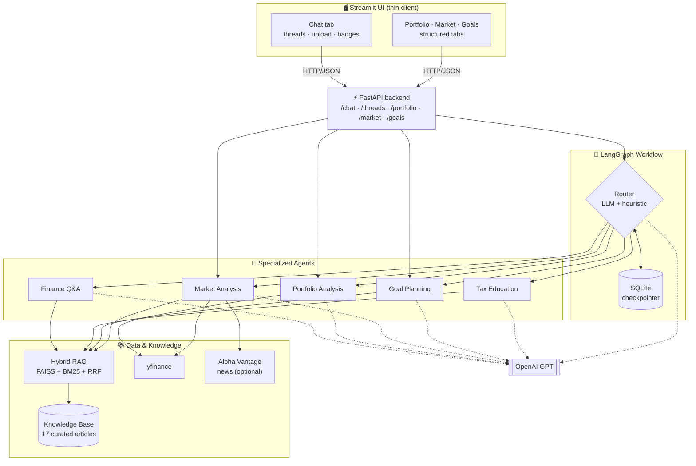
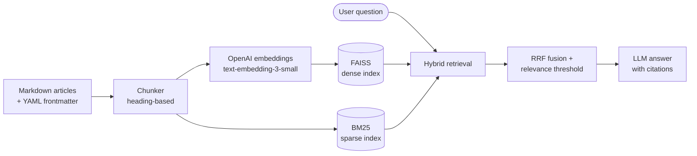

# 📈 AI Finance Assistant

> Democratizing financial literacy through an intelligent, multi-agent conversational system.


A production-minded **multi-agent AI system** that helps beginners learn about investing. Five specialized agents — for general Q&A, portfolio analysis, live market data, goal planning, and tax education — are orchestrated by a **LangGraph** workflow, grounded in a **retrieval-augmented (RAG)** knowledge base, exposed through a **FastAPI** backend, and served to a multi-tab **Streamlit** interface with persistent chat threads. The UI and agent backend are cleanly decoupled — the UI is a thin HTTP client, so the two can be deployed and scaled independently.

Every answer is **educational, cited, and clearly not financial advice** — the safety boundary is built into the architecture, not bolted on.

---

## 🎬 Demo



*A tour of the multi-tab interface — agent-routed chat with cited answers, portfolio analysis with allocation charts, live market lookups, and goal projections in nominal and today's dollars.*

---

## ✨ Highlights

- 🤖 **Five specialized agents**, each with a clean separation of concerns and its own guardrails
- 🔀 **LangGraph orchestration** — an LLM router (with a keyword-heuristic fallback) dispatches to the right agent and preserves conversation state
- 🔎 **Hybrid RAG** — dense (FAISS) + sparse (BM25) retrieval fused with Reciprocal Rank Fusion, so precise financial jargon *and* plain-language paraphrases both land
- 📊 **Real-time market data** via yfinance, with a cached, fail-soft data layer and optional Alpha Vantage news sentiment
- 🧮 **Deterministic math, narrated by the LLM** — the model never invents numbers; it only explains figures produced by tested pure functions
- 💬 **Persistent chat threads** (SQLite) with document upload, agent badges, and inline charts
- 🛡️ **Education-not-advice guardrails** — personalized advice, price predictions, and guarantees are refused and redirected
- ⚡ **Decoupled UI/backend** — a FastAPI service exposes the agents; the Streamlit UI is a thin HTTP client with no agent code or keys
- ✅ **218 tests**, fully offline (no API key or network needed to run the suite)

---

## 🏗️ Architecture



**Two design principles the diagram encodes:**
1. **UI/agent separation** — the Streamlit UI holds no agent code or API keys; it calls the FastAPI backend over HTTP. The backend owns the LLM, the index, market-data access, and the conversation store, so the two halves deploy independently.
2. **Deterministic core, narrated by the LLM** — every agent produces its numbers and retrieves its facts deterministically; the LLM only *narrates* them; and a guardrail layer enforces the education/advice boundary on every response.

---

## 🤖 The agents

| Agent | What it does | How it stays safe |
|---|---|---|
| **Finance Q&A** | Explains investing basics (stocks, bonds, ETFs, diversification, compound interest) from the cited knowledge base | Grounded-only — declines rather than hallucinating when nothing relevant is retrieved |
| **Portfolio Analysis** | Values a portfolio; computes allocation, diversification score, risk level, and gain/loss | All math is pure functions; natural-language holdings are echoed back for confirmation before analysis |
| **Market Analysis** | Live quotes, valuation metrics, trends (SMA-50/200), comparisons, market overview, news sentiment | Refuses price predictions and "good buy?" questions; every result carries a data-freshness timestamp |
| **Goal Planning** | Projects future value with compound growth; maps risk tolerance + horizon to illustrative allocation frameworks | Frameworks are illustrative, never directives; assumptions are always listed; guarantees are refused |
| **Tax Education** | Explains account types (401(k), IRA, Roth, HSA, 529) and concepts (capital gains, dividends) | Refuses personalized tax advice → "see a tax professional"; never asserts current figures → defers to IRS.gov |

---

## 🔎 RAG pipeline



The knowledge base is **17 curated, attributed articles** (public-domain government sources like SEC investor.gov and IRS.gov, the openly-licensed Bogleheads wiki, and original explainers), tracked in a `manifest.yaml` with per-article provenance and license.

---

## 🧰 Tech stack

| Layer | Choice |
|---|---|
| Language model | OpenAI GPT (`gpt-4o-mini`) |
| Embeddings | OpenAI `text-embedding-3-small` |
| Orchestration | LangGraph `StateGraph` + `SqliteSaver` checkpointer |
| Vector search | FAISS (dense) + `rank-bm25` (sparse), fused with RRF |
| Market data | yfinance (quotes, history), Alpha Vantage (news sentiment) |
| Backend API | FastAPI + Uvicorn (auto OpenAPI docs) |
| Web UI | Streamlit + Plotly (thin HTTP client via httpx) |
| Validation | Pydantic v2 (the agent models double as the API contract) |
| Testing | pytest (218 tests, fully offline) |

---

## 📁 Project structure

```
ai_finance_assistant/
├── src/
│   ├── agents/                 # the five specialized agents
│   │   ├── base.py             # shared BaseFinanceAgent + disclaimer
│   │   ├── finance_qa/         # RAG Q&A: model, agent
│   │   ├── portfolio_analysis/ # model, calculator (pure math), agent
│   │   ├── market_analysis/    # model, analyzer, query_understanding, agent
│   │   ├── goal_planning/      # model, risk_assessment, allocation, projection, agent
│   │   └── tax_education/       # model, agent
│   ├── core/
│   │   └── llm.py              # LLM factory (single place for model + keys)
│   ├── data/
│   │   ├── knowledge_base/     # 17 markdown articles + manifest.yaml
│   │   ├── market_data.py      # cached quote service (portfolio)
│   │   ├── market_analysis_service.py  # detailed quotes + history
│   │   └── news_client.py      # Alpha Vantage news (feature-flagged)
│   ├── rag/                    # loader · chunker · embedder · vector_store · retriever
│   ├── workflow/               # state · router · nodes · graph · assistant (LangGraph)
│   ├── api/                    # main (FastAPI app) · schemas (backend)
│   └── web_app/                # app · api_client · context · thread_store · render (Streamlit)
├── scripts/                   # build_index.py + per-agent + workflow demos
├── tests/                     # 218 tests
├── requirements.txt
├── .env.example
└── README.md
```

---

## 🚀 Getting started

### 1. Prerequisites
- Python 3.11+
- An [OpenAI API key](https://platform.openai.com/api-keys)
- *(Optional)* a free [Alpha Vantage API key](https://www.alphavantage.co/support/#api-key) for news sentiment

### 2. Install

```bash
git clone <your-repo-url>
cd ai_finance_assistant

python -m venv .venv
source .venv/bin/activate          # Windows: .venv\Scripts\activate
pip install -r requirements.txt
```

### 3. Configure keys

```bash
cp .env.example .env
```

Then edit `.env`:

```env
OPENAI_API_KEY=sk-proj-your-key-here
ALPHAVANTAGE_API_KEY=your-key-here     # optional
```

> `.env` is gitignored — never commit real keys.

### 4. Build the knowledge-base index (one time)

```bash
python scripts/build_index.py
```

### 5. Run the backend and the UI

The backend (agents) and the UI run as **two separate processes**. In one terminal, start the API:

```bash
uvicorn src.api.main:app --port 8000
```

Interactive API docs are at <http://localhost:8000/docs>. Then, in a second terminal, start the UI:

```bash
streamlit run src/web_app/app.py
```

Open <http://localhost:8501>. The UI reads `API_BASE_URL` (default `http://localhost:8000`) to find the backend — set it if you host the API elsewhere.

---

## 💡 Usage

### The web app
Four tabs:
- **💬 Chat** — ask anything; the router picks the right agent. Switch between persistent threads in the sidebar, or upload a portfolio document (CSV/PDF/TXT).
- **📊 Portfolio** — enter holdings in a table → allocation donut chart, metrics, and concentration warnings.
- **📈 Market** — look up a ticker for a snapshot, trend, or valuation metrics.
- **🎯 Goals** — a projection form with a quick risk questionnaire → a growth chart in nominal and today's dollars.

### Command-line demos
Each agent (and the full workflow) has a runnable demo:

```bash
python scripts/demo_workflow.py                       # routing + multi-turn portfolio flow
python scripts/demo_portfolio_agent.py
python scripts/demo_market_analysis.py "How has Apple done this year?"
python scripts/demo_finance_qa.py "What is dollar-cost averaging?"
python scripts/demo_goal_planning.py
python scripts/demo_tax_education.py "How does a Roth IRA work?"
```

---

## ✅ Testing

The full suite runs **offline** — no API key, no network — thanks to injectable fake LLMs, embedders, and data fetchers.

```bash
pytest tests/ -q                       # 218 tests
pytest tests/ --cov=src                # with coverage
```

---

## 🛡️ Responsible-AI design

This project treats the education/advice line as a first-class engineering constraint:

- **No personalized advice** — "should I buy X?", "is this a good investment for me?" are refused across agents.
- **No predictions or guarantees** — the market agent won't forecast prices; the goal agent won't promise outcomes.
- **No stale numbers** — the tax agent never asserts current limits or brackets; it defers to IRS.gov.
- **Grounded and cited** — knowledge answers come only from the retrieved corpus, with sources shown.
- **Always disclaimed** — every response carries an educational disclaimer, appended outside the LLM's control.

---

## 🗺️ Roadmap

- [ ] Richer document extraction (PDF-statement parsing, image/vision upload)
- [ ] Expand the knowledge base toward 50–100 articles
- [ ] MCP server for Claude Desktop integration
- [ ] Docker packaging and cloud deployment

---

## ⚠️ Disclaimer

This software is for **educational purposes only** and does **not** constitute financial, investment, or tax advice. Market data may be delayed or inaccurate. Always consult a licensed financial advisor or tax professional before making decisions.

---

## 📄 License

Released under the [MIT License](LICENSE). Financial content is grounded in public-domain government sources (SEC, IRS) and the openly-licensed Bogleheads wiki, with attribution tracked per article.

---

<p align="center"><i>Built as a capstone in applied agentic AI — combining multi-agent orchestration, RAG, and real-time data into a beginner-friendly financial educator.</i></p>
